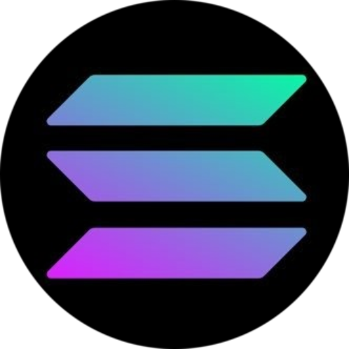

# 💫Syart

#

**`Cyber Security & Ethical Hacker`**

<h3>🧰 Languages and Tools</h3>

#

 👨‍💻My Journey 

#

 ♥️ Support My Work

If you find my projects helpful or valuable, consider supporting me by donating. Your contributions help me dedicate more time and effort to create and maintain open-source projects.

#

### Cryptocurrency Donations:
- **Bitcoin :** `soon` 
- **Ethereum :** `soon` 
- **Solana :** `BFciMoUU5gqLpRXvRvrQUDaVGhKW5uDwEVmzZsefRb8C`

Thank you for your generosity!

